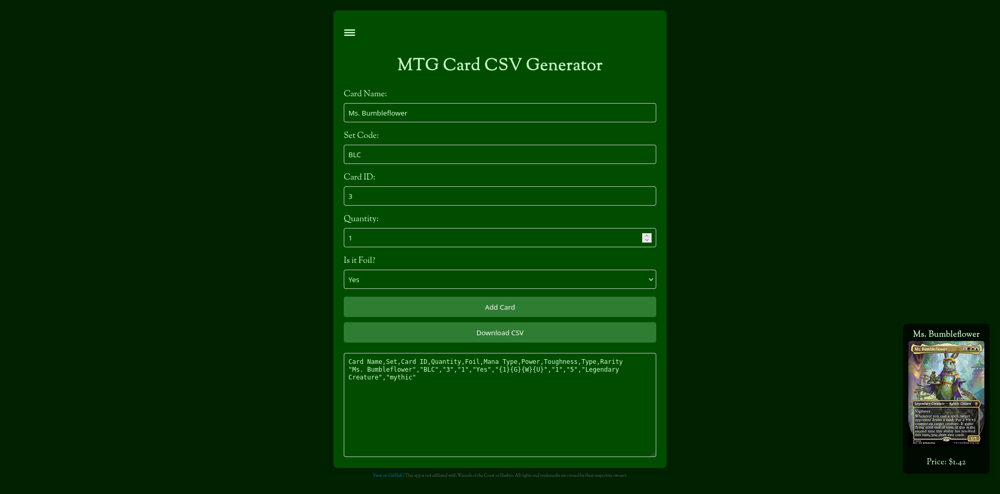
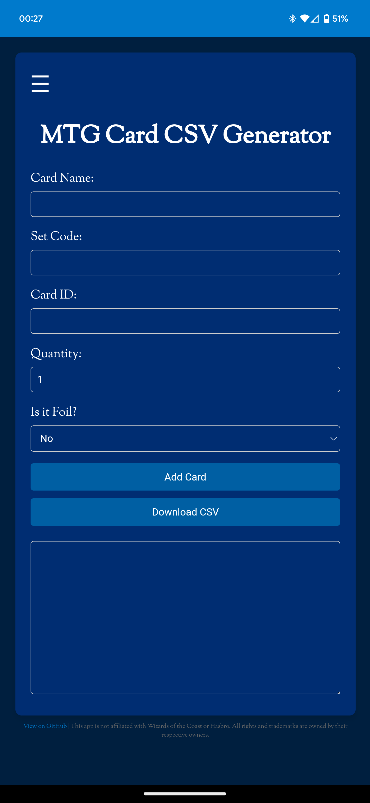

# MTG CSV PWA

Magic: The Gathering Progressive Web App to enter your cards and create a CSV. This utilizes Scryfall's autocomplete function for the card name and pulls the other statistics about the card from Scryfall with simply the name, set code, and card ID number.

## How to run

- Clone the repository to a directory of your choosing
- Install it into your installed webserver's directory (you can also run `python3 -m http.server` in the directory to start a local server)
- Visit the address for your server
- Enter a card name and fill out the other details

## Screenshots

Desktop with the Forest theme selected:

Mobile with the Island theme selected:

